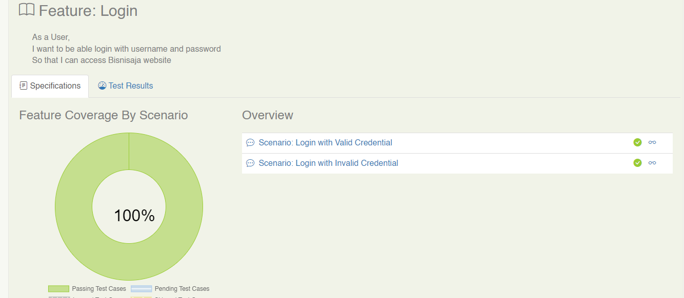
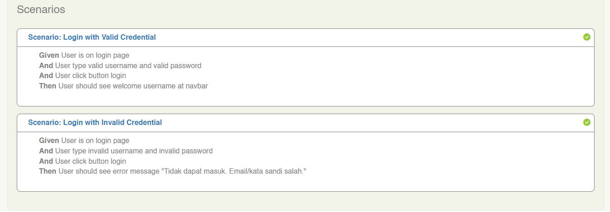
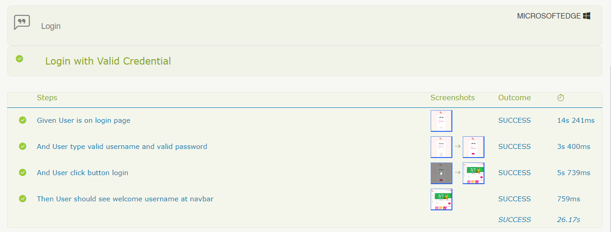

#  Orange HRM Live

This Project Web Automation Testing Using Selenium, Cucumber, JUnit and Serenity BDD for Reporting

## Required

1. Download [Java OpenJDK 11](https://jdk.java.net/java-se-ri/11)
   [Tutorial Installation Java in Windows](https://www.petanikode.com/java-windows/)

2. Download [Maven](https://maven.apache.org/download.cgi?Preferred=ftp://ftp.osuosl.org/pub/apache/)

`*If your computer already installed Java and Maven, you can skip step number 1 and 2.`

## Download Code Editor IntelliJ IDEA Community Edition (Optional)
Download [IntelliJ IDEA](https://www.jetbrains.com/idea/download)

`*IntelliJ IDEA for your code editor is optional, you can still used another code editor like Eclipse or Visual Studio Code.`

## Added New Scenario BDD
 
In order to added some Scenario BDD, we can create new file feature in directory `src/test/resources/features`

## Writing the step definitions (Breaking Down Scenario BDD Into Steps)

In order to translate the steps from Scenario BDD into executable actions, we write Java classes called Step Definitions in directory `src/test/java/steps`

## Writing the Page Object Class

Page Objects are a way of isolating the implementation details of a web page inside a class, exposing only business-focused methods related to that page.
We can create new Page Object file in directory `src/test/java/pageobjects`


## Running Test Case with Default Environment

```
mvn clean verify
```

## Running Test Case with Specific Environment (file `serenity.conf`)

file `serenity.conf` located in folder `src/test/resources`

```
mvn clean verify -Denvironment=value
```

## See Report Serenity BDD

- file report located in `target/site/serenity/index.html`



- Specific Test Details



